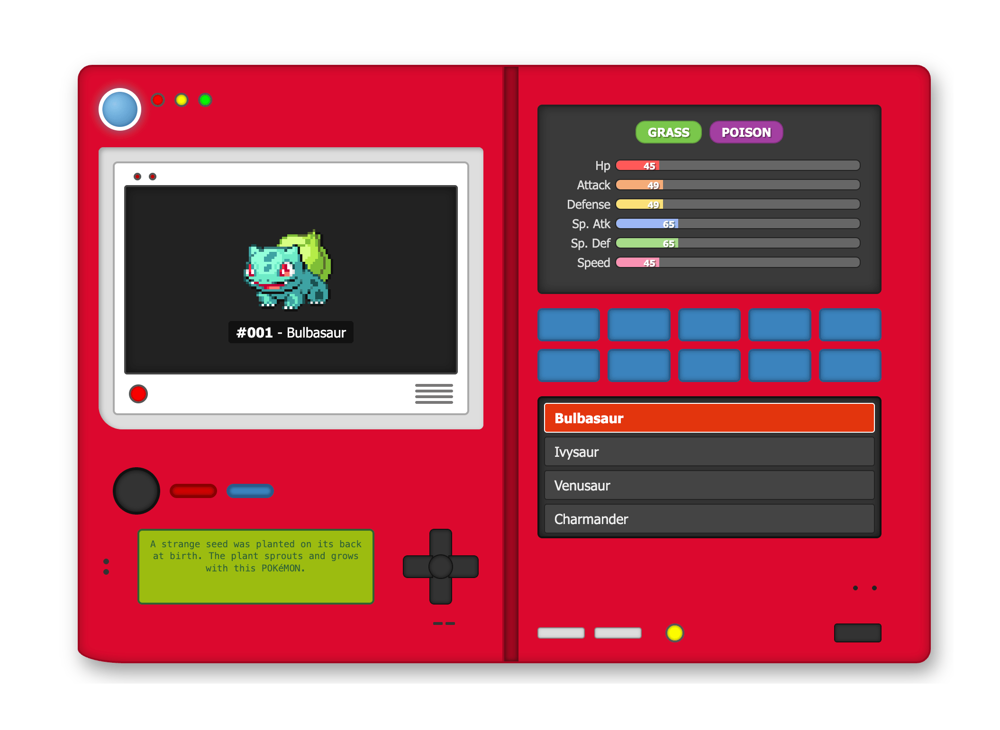

# Classic Pokédex Web App

A front-end web application recreating the look and feel of a classic Pokédex using HTML, CSS, and vanilla JavaScript. It fetches and displays data for the original 151 Pokémon from the public [PokeAPI](https://pokeapi.co/).

## Features

*   **Classic Design:** Styled to "somewhat" resemble the iconic Pokédex device.
*   **Browse Pokémon:** Lists the first 151 Pokémon.
*   **Detailed View:** Displays selected Pokémon's:
    *   Sprite (animated Gen 5 style if available, otherwise static)
    *   National Pokédex Number and Name
    *   Type(s) (with corresponding color badges)
    *   Base Stats (HP, Attack, Defense, Sp. Atk, Sp. Def, Speed) with visual bars
    *   Flavor Text (from Pokémon Red version)
    *   Official Cry (playable by clicking the sprite or during navigation)
*   **Navigation:** Select Pokémon by clicking the list or using the D-Pad buttons (Up/Down for +/- 1, Left/Right for +/- 10, with wrap-around).
*   **Caching:** Uses `localStorage` to cache API responses for faster loading and reduced API calls.
*   **Pre-caching:** Intelligently pre-caches neighboring Pokémon details for a smoother browsing experience.
*   **Responsive Design:** Basic responsiveness for smaller screens (stacks panels, hides right panel).
*   **Escape Key Integration (for Embedding):** Sends a message to the parent window when the 'Escape' key is pressed (useful if embedded in an iframe).

## How to Run

1.  Clone this repository:
2.  Open the `index.html` file directly in your web browser.

No build steps or dependencies are required other than a modern web browser with JavaScript enabled. Simple :)

## Technical Details

*   **API:** Uses the [PokeAPI V2](https://pokeapi.co/docs/v2).
*   **Data Fetched:**
    *   `/pokemon?limit=151` (for the initial list)
    *   `/pokemon/{id_or_name}/` (for individual Pokémon details)
    *   `/pokemon-species/{id_or_name}/` (for flavor text)
*   **Styling:** Plain CSS with Flexbox and Grid for layout.
*   **Scripting:** Vanilla JavaScript (ES6+ features like `async/await`, `fetch`).

## Configuration (for Embedding/Deployment)
*   **Parent Origin for Escape Key:** If you embed this Pokédex in an iframe on your own website and want the 'Escape' key functionality, you need to change the `PARENT_SITE_ORIGIN` constant in `script.js` to match your website's origin (e.g., `'https://yourdomain.com'`).

---

*This project uses data from the PokéAPI. Pokémon and Pokémon character names are trademarks of Nintendo.*

## License
* **Code**: BSD 3‑Clause. See [LICENSE](./LICENSE).
* **Data & trademarks**: Pokémon assets belong to Nintendo / TPCi.  
  This is an unofficial fan project — see [NOTICE](./NOTICE) for details.
  
  No official Pokémon sprites are stored in this repo.  Asset URLs resolve at run‑time from PokéAPI.